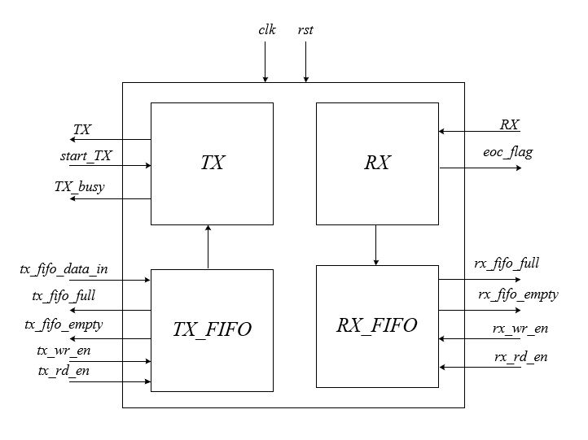
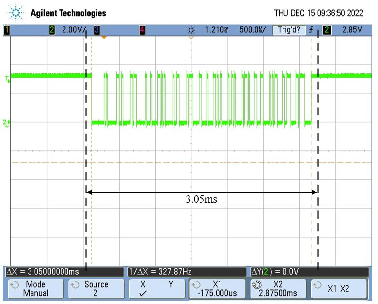
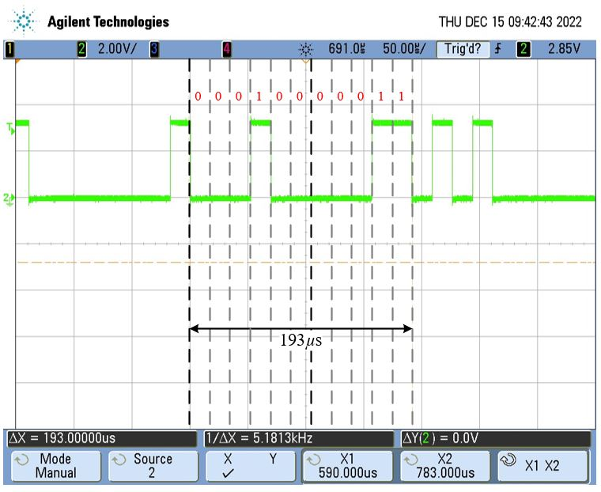

# UART

> SystemVerilog UART implementation  

Implementention in SystemVerilog of __UART__.  
UART trasmitter (TX) and receiver (RX) modules operating in independent clock domains with parity bit for error-checking. Communication sequence as follows:

        

Each sub-module is designed and tested as a standalone unit. A complete UART system is then implemented by instantiating the two sub-modules as well as the TX and RX FIFO memory modules.

> __NOTE:__ A simplified UART system can be found in the 'Simplified UART Module' folder used for educational purposes. The complete UART module is located in the 'Full UART module' folder.

## Get Started

The source files  are located in the following folders :

Simplified UART module files:

- [RX module and TB](./Simplified_UART_Module/RX)
- [TX module and TB](./Simplified_UART_Module/TX/)
- [Simplified UART module and TB](./Simplified_UART_Module/UART/)

Complete UART module:

## Simplified UART module

### UART RX

The testbench includes a task that mimics the TX operation. In each iteration a 9-bit random number is generated (1-parity bit and 8-data bits). The Received data is compared with the sent data along with parity check. Please note that the parity bit is a random number.  

In the following example the sent data is in the bottom of the figure while the received data is in the buffer_RX row. The comparison and parity check are shown in the terminal.


### UART TX

The TB is rather simple: an 8-bit random number is generated in a loop and passed to the UART_TX. The correct bit stream is observed on the UART_line:

A zoom-in:


As can be seen, upon initiation a logic-low value is imposed followed by 8 bits (LSB first), a parity bit (which in this case is zero) and a stop bit (logic high).

Note: In this module there is no stop-bit (it is added in the complete UART module).

### UART TX and RX

The complete UART system comprises an instantiation of the RX and TX module. Again, an 8-bit random number is generated and transmitted along with an additional parity bit. The communication line is shown in the bottom waveform (UART_line) – as can be seen it follows the UART protocol.
The Sent data is compared with the received along with parity check and printed to the terminal. As can be seen, the received data (buffer_RX) equals the sent data (data_rand).

  

An exemplary test result:

  

## Complete UART module

The complete UART module with synchronous TX and RX FIFO can be found in the UART_Module library. Here, a synchronous 32 words FIFO is implemented in the UART module as follows:  

### FPGA-PC Serial communication with FTDI232R IC

Serial communication between FPGA (Intel Cyclone V) and a PC via MATLAB is carried out with FTDI232R IC mounted on an evaluation board (UB232R) to validate the TX and RX modules discussed above. This section will detail the basic commands used to set up the system as well as several exemplary utilizations.  

__Setting up the serial connection:__

1. Open “Device manager” ”Ports (COM & LPT)”
2. Connect the PC to the evaluation board and look for the added “COM” port and its assigned name (COM4 in the attached example)
  

3. Open MATLAB and set up the serial port using the following command:
`s=serialport("COM4",57600,"Parity",'even',"DataBits",8,"StopBits",1)`

Typing ‘s’ shows the serial port settings:

  

### Experimental validation

In this section experimental waveforms and results of the complete UART-PC system executing:

- Multiple bytes transmission from the FPGA to the PC
- Multiple bytes transmission from the PC to the FPGA

1. Open a new project in Quartus environment and include the following files:  
1. High_Arch
2. UART_RX
3. UART_TX
4. FIFO_mem
5. UART

2.Assign TX and RX pins to any available GPIO pins, internal 50MHz clock and a reset controller (preferably a switch) and program the FPGA.

3.Upon positive edge of rst_samp the TX_FIFO is loaded with 16 values (0-15) to be sent to the PC.
The TX enable signa (start_TX) rises to logic high in case the TX is not busy and the TX FIFO memory is not empty.  

  

The TX signal can be observed on an oscilloscope as follows:

  

As can be seen the entire data transmission internal equals 3.05ms which agrees with:
T=16*(1+8+1+1)*(1/57600) = 3.05ms [16 bytes, 1 start-bit, 8 data-bits,1 parity bit, 1 stop bit, baud rate of 57600].

Zoom-in when the TX is transmitting ‘4’:
  

4.Pressing ‘s’ in the MATLAB terminal indicate there are 16 byes available for reading

  

These can be read and printed using the following commands:

```systemverilog
k=s.NumBytesAvailable;
data=[];
for i=1:k
    temp=read(s,1,"uint8");
    data=[data,temp];
end
data
```

5.Transmitting data from the PC to the FPGA (RX FIFO memory) is done using the following command:

### Possible Applications

Implementation of the synchronous FIFO memory in a complete UART module can be found in the [following repository]((./Synchronous_FIFO.sv))

## Support

I will be happy to answer any questions.  
Approach me here using GitHub Issues or at tom.urkin@gmail.com
